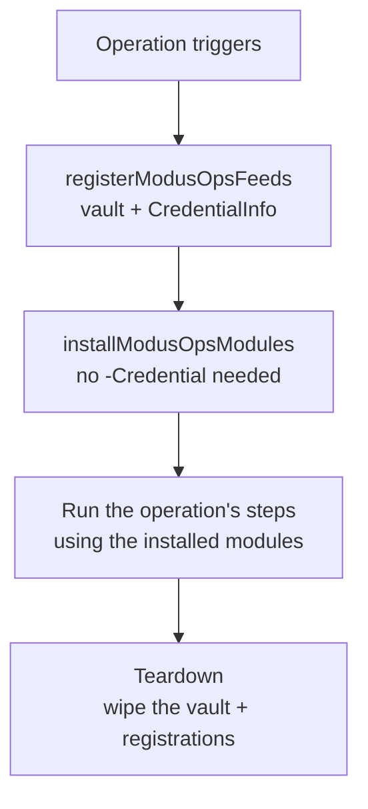

# Architecture - thin operations over version-pinned logic

The central idea is a separation of **what runs** from **how it runs**.

- A **pipeline** (an *operation*) is declarative. It states which steps to run and which **version** of
  each module and template to use. It contains no inline REST calls, no parsing, no duplicated auth.
- The **logic** lives in SemVer'd PowerShell **modules**, published to a private feed and installed at
  runtime by version.
- The **steps** themselves come from versioned **templates** vendored into the repo.

A change in behaviour is therefore a change in **version** - promoted deliberately - not an edit to
live YAML. This is what makes a pipeline auditable: the YAML is small and stable, and the moving parts
are pinned artifacts with a history.

## The pieces

| Piece | What it is | Where it lives |
| --- | --- | --- |
| **Operation** | The thin pipeline/workflow that declares intent. | The consumer's operations repo. |
| **Template** | A reusable, versioned step (an AZD `template:` include or a GH composite action). | The consumer's **templates repo**, vendored from [`modusops-templates`](https://github.com/adrian-andersson/modusops-templates). |
| **Module** | The actual logic, SemVer'd. | A private feed (Azure Artifacts or GitHub Packages); installed at runtime. |
| **Toolkit** | `ModusOps.Toolkit`, the convenience module of common operations. | The private feed, like any module. |

## Runtime flow

The two privileged templates run **in the same job** so the per-run credential vault built by the
first survives into the second. Everything the operation needs is then present as version-pinned
modules; the steps execute; the vault is wiped on the way out.

## Why this shape

- **Promotion, not editing.** Shipping a fix means publishing a module version and pointing an
  operation at it - a reviewable, revertible act with a version history.
- **Thin attack surface in YAML.** The privileged logic is in signed-off module versions, not in
  sprawling pipeline script that is hard to review.
- **Platform-agnostic.** The same shape maps onto Azure DevOps and GitHub Actions; only the feed, the
  token source, and how templates are referenced differ. See the [credential model](./credential-model.md).
