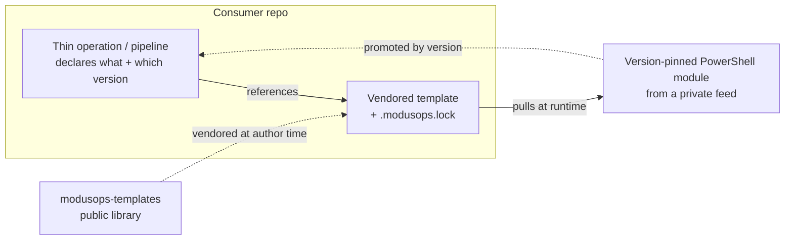

# modusOps

Versioned, security-prominent pipeline automation for **Azure DevOps** and **GitHub Actions**.

Pipelines stay *thin*: they declare *what* to run and *which version* - the real logic lives in
SemVer'd PowerShell modules and templates, pulled at runtime. Behaviour changes by **promoting a
version, not by editing YAML**. The build token is bound per-feed so it is *structurally* incapable
of reaching a public source, which makes the supply chain auditable rather than implicit.

## See it - a whole operation in nine lines

A scheduled security report, end to end. This is the *entire* pipeline:

```yaml
on:
  schedule: [{ cron: '0 7 * * 1' }]            # Mondays, 07:00
permissions: { contents: read, packages: read }
jobs:
  weekly-defender-report:
    runs-on: ubuntu-latest
    steps:
      - uses: my-org/ops-templates/templates/registerModusOpsFeeds@v1   # your templates repo
        with: { feeds: '[{ "name": "modusops", "uri": "https://nuget.pkg.github.com/my-org/index.json" }]', token: '${{ secrets.GITHUB_TOKEN }}' }
      - uses: my-org/ops-templates/templates/installModusOpsModules@v1
        with: { modules: '[{ "name": "ModusOps.Toolkit", "repository": "modusops", "version": "2.3.1" }]' }
      - shell: pwsh
        run: Get-MODefenderIncidents -Since 7d | Send-MOTeamsReport -Title 'Weekly security posture'
```

The token handling, the Defender and Graph queries, the formatting, the retries - all of it lives in
**`ModusOps.Toolkit 2.3.1`**, pulled at runtime and pinned by version. To change what the report
contains, you **promote a version**: bump `2.3.1` to `2.4.0`. You never touch this file, and the diff
that changes production is a one-line version bump someone can actually review.

The alternative - the one this replaces - is a few hundred lines of inline REST calls, token juggling,
and JSON parsing living in YAML that nobody wants to own. Same on Azure DevOps: the
[credential model](./concepts/credential-model.md) and thin-operation shape are identical; only the
substrate differs.

> *Cmdlet names above are illustrative - the point is the shape: two pinned templates, one line of
> intent, all the logic versioned behind the feed.*

## Two halves, one design

modusOps has two halves that share one design:

- **`modusOps`** - the PowerShell module (`MO*` cmdlets) that scaffolds an environment, registers
  pipelines, and vendors templates into a consumer repo.
- **[`modusops-templates`](https://github.com/adrian-andersson/modusops-templates)** - the public,
  versioned template library the tooling pulls from (Azure DevOps includes and GitHub composite actions).

> modusOps is built with **[ModuleForge](https://adrian-andersson.github.io/ModuleForge)** - the same
> scaffolding, SemVer, and release-integrity conventions apply here.

## Sections

| Section | |
| --- | --- |
| [Getting Started](./getting-started.md) | Install modusOps, scaffold an environment, vendor your first template. |
| [Concepts](./concepts/) | The architecture, the credential/vault model, and the security stance. |
| [Templates](./templates/) | The `modusops-templates` library: how templates are versioned, vendored, and pinned. |
| [Tutorials](./tutorials/) | End-to-end setups for Azure DevOps and GitHub Actions. |
| [Functions](./functions/) | Reference documentation for every exported `MO*` cmdlet. |
| [FAQ](./faq.md) | Common questions and troubleshooting. |

## The core idea in one picture



The pipeline orchestrates; it never carries inline REST calls, parsing, or duplicated auth. Those
live in the versioned modules. A new behaviour is a new module version, promoted deliberately.
